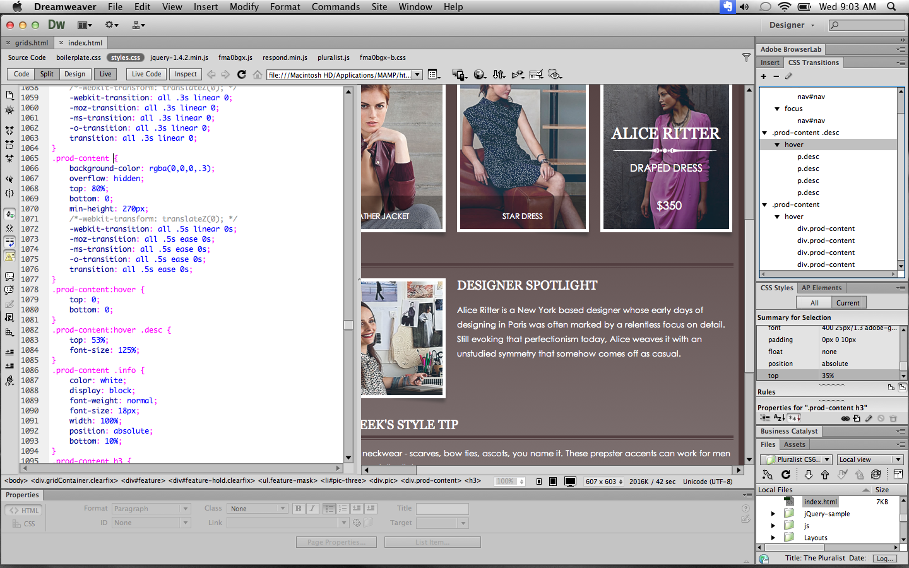
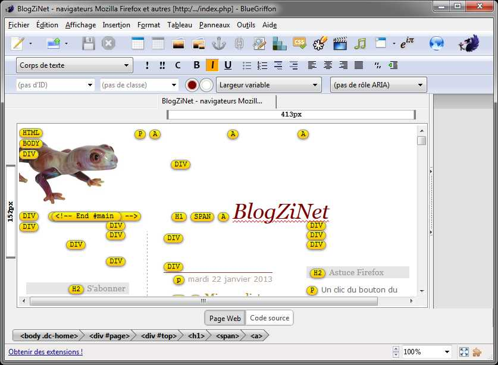
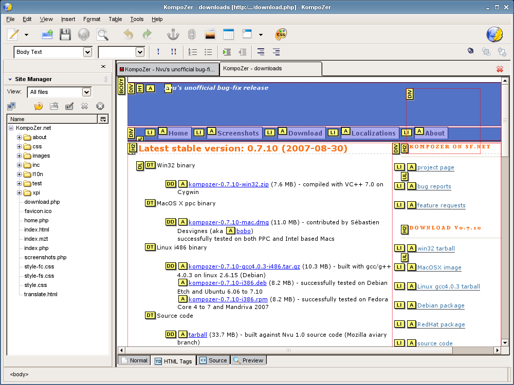
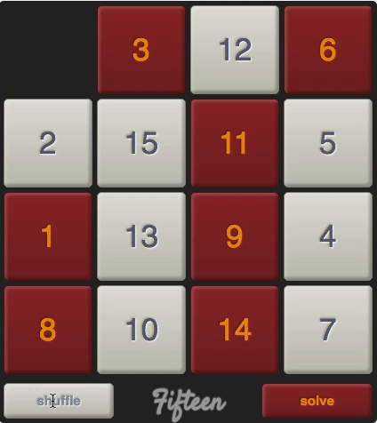

# Zen White Paper: Owning the Web

Version 0.7.3 
by Tom Elam 
Elam & Associates 
Mysuru, India 
August 23, 2016

## Introduction

This white paper presents a new and profoundly personalized,
adaptive approach to the creation of Web experiences&mdash;a new approach
open to use by a very broad class of people.
A software system called <em>Zen</em> is being created to explore this approach.
Why a new approach is desirable and how it will work are the subjects of this paper,
but digital archaeology can provide some context.
A video showing the operation of the first web browser clearly shows that
at least one of the functions of web technology has not received equal attention as the rest.
At 12 minutes and 9 seconds into the video, the editing function of the first web browser is demonstrated:

     

When Sir Tim Berners-Lee created the first <em>browser</em> for his new invention, the World Wide Web,
he intended it to enable easy collaborative authoring,
but as he himself says, "It didn't really take off that way."[2](#2), [3](#3), [4](#4)
Now, a quarter of a century later,
the position of the A-grade web browsers[4](#4), [5](#5), [6](#6), [7](#7)
as the central applications for online sharing seems unshakeable.
Yet till today, not one A-grade web browser has full-fledged Web-authoring capabilities.
The direct descendents of Berners-Lee's early web-page editing application
are visual web-page editors in three broad categories:

* Instant-feedback, web-page-embedded, JavaScript-based, in-place web-page editors
that convert HTML textarea fields or other HTML elements into editor instances.
TinyMCE and jeditable are typical examples.

* Standalone web-page editors that operate on web-page source
and show a preview of the resultant web page.
Source can be HTML or markup that can be translated into HTML.

* WYSIWYM semantic web-page editors.
Examples of this type of editor are WYMEditor, RDFaCE, BlueprintUI, PageDown, and Showdown.
Source can be HTML or markup that can be translated into HTML.

### Critique of current WYSIWYG web-page composers

All the well-known standalone or embedded WYSIWYG web-page composers
approach web-page composition like 2-D drawing programs&mdash;that is,
as a layout or graphic design problem,
rather than as an organizational (structured, semantic, dynamic design) problem.
Typically visual web-page composers are designed
merely to provide a gentle approach to HTML editing,
leaving out important aspects like styling based upon semantic meaning;
reactive widgets; and dynamic (AJAX-enabled) web pages.
They often sport a button to switch to an HTML source view.
Their interfaces are reminiscent of IDEs or RAD tools provided by frameworks.
Indeed, WYSIWYG web-page composers are sometimes included in IDEs.
Maqetta provides an interesting and unique approach to WYSIWYG
web-page composition, in that it supports composition with OpenAjax widgets:

* OpenAjax widgets

* "allows User Experience Designers (UXD) to perform drag/drop assembly of live UI mockups,"

* includes "deep support for CSS styling (the application includes a full CSS parser/modeler),"

* includes "a mechanism for organizing a UI prototype into a series of 'application states'
(aka 'screens' or 'panels') which allows a UI designer to define interactivity without programming," and

* "Maqetta's code base has a toolkit-independent architecture that allows for plugging in
arbitrary widget libraries and CSS themes."

Here are screenshots representative of composers in this class:

      
     Adobe DreamWeaver

     
    BlueGriffon

     
    Maqetta

     
    KompoZer

     
    CKeditor

     
    TinyMCE

### Critique of current WYSIWYM web-page composers

WYMeditor is the best-known WYSIWYM web-page composer, but development on it was halted in 2013.
It 

    

### How Zen will be different from current WYSIWYG and WYSIWYM web-page composers

Zen will adopt an embedded, instant-feedback, WYSIWYM (not WYSIWYG) approach
to bring the authoring of novel, Semantic-Web applications
out of the exclusive province of programmer-specialists and put it into the hands of
amateurs and dilettantes (in the original, non-pejorative sense of the words).
"Universal access of information" is taken to mean
democraticization of the methods of creation of Web experiences,
in the sense that present methods are strongly focused on the preferences
and skills of a technocracy, which excludes the vast majority of users
from easily creating web experiences that are two-way (for example, blog with viewer comments)
or multi-way (for example, forums and wikis).[1](#1)
Even though some "website builders" and web CMSs
*do* help their users create comment systems, forums, or wikis,
customization of such template-, plugin-, and module-based website builders and Web CMSs
is notoriously difficult and frought with API-mismatch problems.
Novel categories of applications cannot be implemented
where all the possible templates, plugins, and components
have already been specified by the framework developers.
It can be said that the means of creating Web experiences are already
personalized, collaborative, and adaptive, but as soon as an amateur or dilettante
seeks out advice about how to create something on the Web&mdash;and
retain complete control and <em>ownership</em> of his creation&mdash;he encounters
a massively confusing flood of conflicting, opinionated advice and immediate discouragement
of the idea that creating a web app could be simple.
There are just too many details that have to be handled
in the creation of good Web experiences.

## Principles

As pointed out by David Ungar, who developed the prototype-based language Self,
from values arise principles and from principles arise practices.[8](#8), [9](#9)
We have just explored the <em>values</em> behind the creation of the Zen system.
Now let's explore the principles of the Zen system.
Zen will complement the approach of Lively Kernel,[11](#11), [12](#12)
which shares Zen's principles 1 - 3 as listed below.
How much, if any, of Lively Kernel's code it will borrow is yet to be determined.
Note, in particular, the following principle 11 of Zen that is different than
the principles of Lively Kernel:

1. It will run in any browser without a download and without installation.

1. It will be a composition environment, a GUI builder.

1. It will store its apps as web pages, even new versions of itself.

1. It will use only the DOM's interfaces[10](#10)
for the composition of web pages and web GUIs
by element <em>insertion</em>, <em>manipulation</em>, <em>editing</em>,
and <em>deletion</em>
as opposed to <em>drawing</em> objects using SVG or Canvas operations.

1. Zen will not provide IDEs, but instead will
allow objects in its compositions to be inspected and edited
via a Morphic[12](#12)-like interface.
Zen will allow its simple programs to be inspected and edited
in a normally hidden visual programming environment, using
HTML elements like DIV to model nodes in the program's abstract syntax tree (AST).
Zen will enable these program nodes or blocks to be copied, pasted, and moved,
just like the normally visible parts of a Zen web page.

1. It will enable its users to easily compose sequential programs, that is,
programs that can wait for external, asynchronous events such as user input or I/O.
This will be accomplished by instantiating true continuations
in an interpretter running on top of JavaScript in the web browser.

1. It will exist as a library that can be loaded into any web page to provide
the page with Zen's capabilities,
although caution will be required to ensure compatibility.

1. It will <em>complement</em>, <em>augment</em>, and <em>interact</em>
with existing web-page editors and website builders, not replace them.

1. It will allow the Zen-editing of a web page to be locked,
leaving intact the form and behavior it built inside the web page.

1. Zen will not add more than 1 - 3 seconds to the TTI (time to interact)
for a web page.

1. Zen will not follow Lively Kernel's principle
of implementing a scene graph.[11](#11)
Instead, it will honor the composition model of the Document Object Model (DOM)
API used to model and make changes to a document in a web browser.
Zen will not be able use SVG or Canvas graphics for the creation of objects,
except where particular Zen-composed apps borrow the pertinent capabilities
from other Web applications.

## Zen vs. Website Builders and Web CMSs

It is important to characterize and visualize how Zen will be different from
"website builders" and web CMSs
like Wix.com, Weebly.com, and ______.
In contrast to Wix.com and Weebly.com, which prescribe construction methods at the level of
business type, templates, plugins, modules, fonts, etc.,
Zen will give the user ultimate control of detail at the element/node/NodeList level of web pages.
Zen will allow a DOM node to be grabbed and "dragged" to different positions
in its containing NodeList because this is the simplest metaphor for that operation.
Zen will allow a DOM node to be "cut and pasted" to any valid position in the DOM&mdash;an
interaction between multiple NodeLists.
An HTML element's style has four possible values for its *display* property:
*block*, *inline*, *inline-block*, and *none*.
Live demo code to implement GUIs to rearrange element positions in the NodeLists
of the first three of these display styles is
[located on the author's GitHub Pages](http://tomelam.github.io/zen/whitepaper/experiments/NodeLists/block.html).
The method of sliding elements in these prototype GUIs was partly inspired by the 15 Puzzle
and JavaScript-based implementations of the 15 Puzzle.
[There are notes about some of these implementations on
tomelam.info](http://tomelam.info/~tom/experiments/NodeLists/15-puzzle.html).
Here is a screen capture of Jamie Wong's AI-based
automated 15-Puzzle solver, which is written solely in JavaScript, HTML, and CSS.

    

## Zen Practices

We have explored the <em>values</em> and <em>principles</em> behind the creation of the Zen system.
Now let's explore some of the <em>practices</em> to be followed in Zen's creation.

### Concessions to Zen's GUI

Some concessions to manipulability are necessary so that Zen can successfully edit all webpages.
When HTML elements are grabbed 
Zen should temporarily apply suitable styles to HTML elements like high-contrast borders
to make them visible during element selection.
When the display-style property of an HTML element is *none*,
Zen should make it possible for users to temporarily set it to another value so the element can be seen.
Likewise, wherever desired,
Zen should employ similar tactics to make all elements visible and manipulable,
whether they are too small; too big; animated; or too transparent.
Zen should employ intuitive, adaptive, custom cursors with contrast and distinctive patterns
that show up with whatever colors are behind them.
The following animations are actually screen recordings of rough-prototype GUIs
for rearranging NodeLists that contain just *blocks* or just *inlines*, respectively:

    

    

(The operations of the *inline-blocks* and *inlines* demo-GUIs look identical,
so just one is shown.)
Zen's drag-and-drop and cut-and-paste by themselves would get overly tedious and repetitive,
but they will be automated using Zen's visual programming environment
and leveraged by support and readymade functions
provided a highly networked community built for Zen programmers and users.

### Scope of the Issues Zen Will Address

We must determine the scope of the issues Zen will address, which appears to be huge.
Zen is meant to offer a uniquely democratizing way of creating web experiences.
Nowdays the creation of Web experiences is managed by a galaxy of software packages
and services, JavaScript libraries, and CSS libraries,
but by viewing this galaxy through the prism of the question
"What level of detail does the package or service address,"
each package and service can be tentatively placed somewhere along a spectrum.
[Image to be included here.]
At one end of the spectrum, users or developers deal directly with HTML, CSS, and images,
crafting the details of Web pages individually,
with no further abstraction or intermediation.
At the other end of the spectrum, users or developers have at their disposal
many abstractions and are coaxed or prodded into dealing with higher-level
concerns like minimization of Web assets, quick development,
responsive design, patterns, standards, metaphors, and affordances.
There are problems with this oversimplification, of course, and some packages
and services should appear more as a blob
rather than as a single point on the spectrum,
but the metaphor of a spectrum enables us to filter an unmanageably long list of
Web technologies so we can concentrate on comparing like with like.
Towards one end of the spectrum (the brass-tacks end) is an enormous set of front-end
(JavaScript and CSS libraries and toolkits) and back-end (web servers with CGI capabilities),
purely for hand-coded website creation, serving, and management,
including the management of website-triggered ancilary services like email and payments.
Let us call this the "Red End" of the Web software and services spectrum.
It allows the Web developer complete control of his Web site
at the expense of getting his hands very dirty.
Right at the Red End, he directly controls every character
of his every Web page and, if applicable, every table and query
definition in his back-end database.
A developer working slightly removed from the extreme Red End
probably engages with templates, themes, and skins.
He might also use plugins.
Anywhere close to the Red End or right at the Red End,
the developer might use a content management system (CMS)
or blog software to create a database-driven dynamic Web site
or a static Web site (such as Moveable Type used to generate).

The Red End originally comprised just text editors, web servers, and web browsers
and was designed and built to use a stateless protocol for transporting hypertext documents.
The Web was later retrofitted with mobile scripting languages Java and JavaScript
to create a platform for distributed applications.
Web servers eventually developed sufficiently to support collaborative authoring applications.
One cycle of development was thus completed, bringing the Web back around
to Berner-Lee's original dream of collaborative authoring, but
Berners-Lee's original vision of a simple, easy, collaborative authoring tool for everyone
lost out to the current ad hoc proliferation[8](#8) of non-standard,
anonymous, front-end tools.[8](#8)
These anonymous tools typically do not offer Web-technology dilettantes and Web power-users
the facility to add nested structure to HTML; to add JavaScript-backed widgets like
AngularJS, Dojo, ExtJS, jQuery UI, or web-component widgets; to add Web forms;
to develop CSS class hierarchies and frameworks; or even to collaborate in a structured way.
The Red End for nontechnical people can usually only
create flat, static layouts of single pages,
not complicated, dynamic structures, and it often emphasizes
a code view of Web pages (raw HTML and CSS) as much as a WYSIWYG view of pages.
Thus the Red End for nontechnical people is not very powerful and often is hard to use.
Meanwhile, on the back end, control of the web frameworks is mostly left up to
programmer-specialists.

Nowdays many web applications are built inside walled gardens.
Even IDEs like Eclipse, IntelliJ IDEA, NetBeans are in at least a small sense walled gardens
because they impose their own formatting upon source-code files.
Many amateur and professional developers do Web development using
rigid software Web application servers that sell for hundreds of thousands of dollars,
such as IBM WebSphere Application Server and Red Hat JBoss.
Developers who use such application servers often deal with rigidly defined software modules
rather than more basic APIs like RDBMS queries and JavaScript library APIs.
Nowdays most online collaboration by nontechnical people does not involve
the restructuring of web pages or websites.
Instead, it only involves the insertion of data, such as blog or forum posts,
into databases, to be queried later.
This is a very strict limitation.
Let us call this the Web application servers and Web services the "Violet End".
It is imminently possible to imagine highly flexible, desktop-app-inspired
table, form, query, and report design being built into the Violet End,
but such capabilities are not common.
Nontechnical people are offered very few simple ways to <em>program</em> websites.
The latest and greatest "Web experience management" software and services promise
to bundle all that is needed to handle xxxxxx.
Given the vastness of the field and the inconceivability of a way to integrate all such xxxx
they end up being like the packaged and preserved MREs (meals ready-to-eat) or Pop-Tarts®.
Furthermore, although there are hundreds or thousands of useful Web services that can be tapped,
very often for free, specialist programming is necessary to use them.

There are many difficulties or problems in implementing simple ideas on the Web
due to complexities at the Red End and the leaky abstractions at the Violet End.
First we shall list just a few of those problems&mdash;not in a very systematic way, but almost like a small collection
of anecdotes. After creating an initial small list of problems, we shall take an initial, inadequate stab
at listing a set of "solutions". After this first, inadequate attempt, we shall delineate the method we are adopting
to conquer them with a set of technologies I have loosely been calling "Zen".
Finally, we shall attempt to discover a systematic way of cataloging problems with the Web experience
so that functional specifications can be created for software layers and modules to improve the Web experience
systematically.

**Problem #1: Paucity of means for nontechnical people to author Web documents and websites.**
One of the biggest problems or shortcomings of current web browsers is their lack of authoring
facilities.

**Problem #2: No utility for Web copy/cut/paste/mashup.** To effectively manage the tremendous load
of linked information raining down on him,
the Web user should have a robust _utility_ for managing hypermedia in the native environment in which he encounters
that hypermedia&mdash;the Web environment. A utility built upon the Web can have features that a desktop utility
cannot have, foremost of which are instantaneous change and ubiquitous access.
The Web user should have high-quality, proven Web user interface shortcuts most appropriate to manipulating
information from the Web&mdash;for example, the "Rich Interaction" patterns described in the Yahoo Design Pattern
Library&mdash;so he can quickly clip, mash together, and rearrange information from the Web.
This interface must interwork with any A-grade web browser.
Incomplete, specialized, "opinionated" services, such as EverNote and Instapaper, do not support the ad hoc creation of
drawers, panels, and dialogs, which are necessary to cut, paste, transclude[9](#9), organize, associate,
link, tag, and hide blocks of information. This problem is inherently related to **Problem #1**, but it is also
related to various Web standards, such as the X-Frame-Options standard.[10](#10)

**Problem #3: Limits to the ability to remember paths through the hypermedia sphere.**
In 2016, decades after the invention of virtual memory, web browsers still can't get enough memory,
causing themselves and their host operating systems to malfunction, to crash, or to function poorly.
Never mind the waste of the Web user's time.
When the "too many tabs" problem forces the user to close tabs, or causes the browser to slow to a crawl,
or crashes the browser, the reminders to the user about how he discovered the Web pages he visited get lost.
This is a travesty because many of the user's research insights are won by a hard, painful, lengthy
search.[10](#10) For now, the problem can only be somewhat ameliorated
by adopting rare, non-free tools, such as the Tabs Outliner plugin for the Chrome web browser.[12](#12)
The right juxtaposition, encapsulation, and highlighting of blocks of information would make
it unnecessary to keep open many browser tabs at once and would make it possible to record the user's path
through the hypermedia sphere. To make these kinds of arrangement easy,
a new _utility_ is necessary.

**Problem #4: Bookmark managers inbuilt to web browsers are inadequate for their main purpose.**
Inbuilt bookmark managers are too slow to respond to user input.
Furthermore, they do not have even the most basic, useful organizational utilities&mdash;
for example, an interface, such as the desktop's drag-and-drop interface for folders and files,
or automatic Web-page-content indexing and retrieval based upon content.
Many web services that analyze websites could be proxied automatically by the Web browser:
services as Alexa.com (formerly providing free information), the WHOIS service,
and Yahoo's free web service that does a semantic analysis of a website and provides a description of that website.
Inbuilt bookmark managers are tied to a particular web browser, which forces dependency upon the user&mdash;not a
good thing.

**Problem #5: Lack of personal ownership of bookmarks.** Web services such as Xmarks,
which archive a user's bookmarks, force the user to give up
ultimate responsibility for his own bookmarks and put the bookmarks
into the hands of a company or organisation that could
go out of existence or suspend services.[13](#13), [14](#14), [15](#15).
Xmarks was even made unavailable for awhile in India by court order.[16](#16)
In the last few years there has been panic[17](#17), [18](#18) and uncertainty[19](#19), [20](#20)
surrounding the spate of security breaches by web services that have revealed clients' sensitive data,
such as usernames, passwords, and credit-card
credentials.[21](#21), [22](#22) There should be a utility to make a Web user's bookmarks
available _offline_ and/or on the user's _own_ website.

**Problem #6: There is no universally available bookmark file facility.** Online collaboration
is not supported by good integration of bookmark files with the desktop.
For example, on a Mac, dragging a URL from Safari's address bar
to the desktop creates a file with type "webloc" that MS Windows does not understand by default. It is possible
to create a file with type "url" that Windows, Mac, and Ubuntu all understand, but this is not currently happening.

## Initial Questions and Ideas for Zen Development

Now we shall make our first foray into describing Zen.
How do we propose to solve the problems listed in "Introduction"? Which of the following do we want to focus upon?

1. A Lego-like construction kit, basically for building a Website (or web page) from scratch? Such a construction
kit would concentrate upon a tall stack of capabilities based upon a narrow, "opinionated" trunk of foundational
technologies. Examples of the foundational technologies could be a CSS framework like Bootstrap or Foundation,
a CSS grid system like 960 Grid System, a CSS framework oriented to working with web components,
components from customelements.io or webcomponents.org, and widgets from ExtJS or the Dojo Toolkit.

1. A tool kit for creating or modifying web pages? Such a tool kit would concentrate upon the broadest possible
comprehension of different kinds of web components in the broadest meaning of the term&mdash;including
JavaScript-based widgets. Such a tool kit could not reasonably be made to comprehend attached JavaScript,
but could understand the protocols of JavaScript-based widget libraries to intervene in and interact with
the lifecycle of widgets. Such a tool kit could not reasonably comprehend other JavaScript, but could leave that
JavaScript untouched. Such a tool kit could not reasonably be able to add useful, arbitrary JavaScript to a web page,
but could add a very broad class of visually programmed functions as described later in this white paper.

Whichever path we choose&mdash;the creation of an isolated silo of technology
or the utility belt of tools&mdash;there are
some data-wrangling capabilities it seems Web users should be getting for free, but aren't.
These could be part of a Zen Manifesto:

1. Simple copying, cutting, and pasting of text, images, HTML components, and widgets should be possible.
It should be possible to save various versions of these copied or cut items in a repertoire of
patterns&mdash;with or without the text and images, with or without style
classes, with or without style overrides. It should be possible to add parameters to the patterns so they can
be used to easiy add to the Web. The patterns should be stored in a version control system
that makes branching of versions very easy, as Git[23](#23) does.

1. The Web user should have the ability to create spreadsheets (like Google Sheets[24](#24) via simple
drag-and-drop. It should be possible to drag and drop whole cells, rows, and tables without even double-clicking
and swiping the mouse pointer across words. These spreadsheets should be able to include images.

## Diving Deeper: Zen According to <em>The Elements of User Experience</em>

Jesse James Garrett, who coined the term AJAX, wrote an influential book entitled <em>The Elements of User
Experience</em>[25](#25),
which will serve to inform the strategy for the development of Zen.
(The acronym AJAX refers to a set of Web technologies
that enable the Web to be used as a remote software interface and employing
JavaScript and asynchronous HTTP requests.)
Garrett's elements are summarized in a chart[26](#26).
The "Surface Plane" described in that book corresponds roughly to the concerns of the Red End;
the "Strategy Plane" to the concerns of the Violet End.

### User Needs for a "Zen Website"

There is a very specific set of user needs that a "Zen website" can uniquely fulfil.
At least some of these are:

1. A Web CMS that eschews text-based "code" in favor of a direct manipulation interface (DMI).

1. A Web CMS that excels in the management of intermeshed or intertwined trees and meshes of data of many types:
Document Object Models (DOMs, including shadow DOMs),
including at least nodes implementing the HTMLElement, Attr, and Text interfaces;
CSS classes;
link trees and meshes;
See ["DOM Standard"](https://dom.spec.whatwg.org/).

1. A Web CMS (or WCMS) that can nest web components and widgets with no arbitrary limit.

1. An easy way to consume and perhaps even interrelate Web schema. (See schema.org.)

### Site Objectives of a "Zen Website"

If there is a site objective, then there must be a website. If that website has a tight focus,
it must be oriented toward a particular segment of its entire potential user population (that is,
anyone who comes to the website). My initial attempt to segment users was this:

1. Users who are only fluent in the most basic Web-application constructs: URLs (or URIs), browsers, windows,
links, and maybe simple, clear buttons.

1. Users who are fluent in most of the basic, modern user interface patterns used in modern Web applications
like those described in the Yahoo Design Pattern Library[27](#27), such as Top Navigation, Accordion,
Breadcrumbs, Tabs, Navigation Bar, Calendar Picker, Collapse Transition, Expand Transition,
Slide Transition, and Drag and Drop.

1. Users with enough prior experience and intelligence to quickly adopt new methods of interaction with
computers, such as a Windows user who can adapt to an Apple laptop computer, or a user who can learn
about dragging and dropping URLs into a web browser or a images from the web browser to the desktop.

1. Users who can productively use a complex, specialized Web application such as a Web-page design application,
an application for photo manipulation, a paint application, an application for technical analysis of financial data
&mdash;an application that typically cannot be learned in less than an hour. Some of the barriers to learning such
an applicaition more quickly are jargon, densely packed user interface elements, and domain-specific knowledge.

A bit of reflection and research determined that I need to seek out experts' Web user segmentation.
That quickly turned up the topic of "web analytics user segmentation", where there is much good information
available for free. However, "levels of Web user ability" is a topic I have not explored much at all.
It appears there is some very good guidance in the blog entry
["Enabling new types of web user experiences"](https://www.w3.org/blog/2013/08/enabling-new-types-of-web-user/).
A key insight in that post is that currently the dominant model of how web apps should be experienced
is that they should be "web ports" of iPhone apps. The author of the post believes that is aiming far
too low in aspiration. He gives some examples of devices like doorknobs and toasters broadcasting
web services over Bluetooth or WiFi. Such ideas, while not directly providing much help to Zen development,
provide inspiration for the necessary lateral thinking.

#### "Zen Website" Use Cases

* Organizing the user's own text collections as hypertext in order to manage relationships
between various pieces of information, particularly hypertext documents
* Creating a "notebook" or "log"
* Creating a Web app for further personal Web exploration and use
* Creating a website or Web app for creative or commercial use
* Create any kind of webiste by doing the front-end design, the front-end programming, and the backend programming

In lieu of the last use case, I would like to go as far as I can with certain key ideas:

* Enable a very short and very simple edit-compile-debug-commit-backup-deploy cycle.
* Use web continuations and block-oriented visual programming to enable front-end programming in the
simple, logical, linear style of programming for a non-event-driven environment, with operating system
constructs like "wait".
* Since it is unnatural and sometimes dangerous to edit a live interface, use a run-edit toggle.
* Use visual paradigms and patterns like sliding DIVs, temporary absolute positioning,
the web browser's Z axis, parallax, and drag-and-drop.

#### Unanswered Questions

How to convey the proper central concept behind the "Zen website"?
Is the central concept for the Zen website all about being "on the same page"?
Would a better encapsulation of the gestalt of Zen be "own the web" or "your web" or "my web"?
Possible catch phrases to encapsulate the gestalt of Zen are:

* "Own the Web"
* "On the same page"

The following domain names that could convey the Zen concept are or appear to be squatted upon:

* otw.com ("Own the Web")
* ownweb.com
* pweb.com ("Personal Web")
* cweb.com ("Collaborative Web")
* meweb.com
* otsp.com ("On the Same Page")
* zenweb.com
* zweb.com

The following domain names are for sale:

* owntheweb.com
* myownweb.com
* nowweb.com

The following domain names might be for sale:

* myweb.com (currently selling emoji collections)
* newweb.com (no DNS address)

The following domain names seem somewhat less likely to be for sale at an affordable price:

* osp.com ("On the Same Page", but currently in use to sell fiberoptic products under the brand name OSP)
* youweb.com (redirects to videomeet.pro)
* yourweb.com (redirects to secureserver.net)
* collabweb.com (in use and might be a competitor to Zen)
* me.com (redirects to Apple's icloud.com)

## For Further Study

1. GGG and the Semantic Web. (Very important. Could be greatly helped by Zen.)

1. Lively Kernel.

1. Structured scene graph.

1. Context Oriented Programming.

1. ContextJS.

1. Morphic.

1. Morphic for JavaScript.

1. doCOUNT, related to Morphic.

1. BYOB, related to Morphic.

1. The principle of Lively Kernel that it has no run/edit mode distinction, that is,
the whole environment is live all the time: the environment runs, the debugger, and the editor
all run at the same time.

1. APIs for clipboard operations such as copy, cut and paste in web applications,
as described at ["Clipboard API and events"](https://www.w3.org/TR/clipboard-apis/) on w3.org.

1. Publications of the Web Platform Working Group at w3.org.

1. ["Defining Good," Silicon Valley Product Group](http://www.svproduct.com/defining-good/).

## Notes

1. <a id="1">[Pallab Ghosh, April 30, 2013, "Cern re-creating first web page to revere early ideals", BBC.com,
retrieved August 11, 2016.](http://www.bbc.com/news/technology-22249490)</a>

1. <a id="2">[Scott Laningham, August 22, 2006, "developerWorks Interviews: Tim Berners-Lee," IBM.com,
retrieved July 8, 2016.](http://www.ibm.com/developerworks/podcast/dwi/cm-int082206txt.html)</a>

1. <a id="3">[Berners-Lee, Tim, and Mark Fischetti. 1999.
_Weaving the Web: The original design and ultimate destiny of the World Wide Web by its inventor_.
HarperSanFrancisco, San Francisco.](https://www.w3.org/People/Berners-Lee/Weaving/Overview.html)</a>

1. <a id="4">[Jim Boulton, Kalle Everland, Jesper Lycke, 2014.
video entitled "A demonstration of the first web browser, the Nexus browser",
DigitalArchaeology, YouTube.com,
retrieved August 22, 2016.](https://youtu.be/3c3Rt6QbHDw)</a>

1. <a id="4">["Browser Support," Mozilla Wiki,
retrieved July 8, 2016.](https://wiki.mozilla.org/Support/Browser_Support)</a>

1. <a id="5">["Graded Browser Support," YUI3,
retrieved July 8, 2016.](https://github.com/yui/yui3/wiki/Graded-Browser-Support)</a>

1. <a id="6">["jQuery Mobile 1.4 Browser Support," jquerymobile.com,
retrieved July 8, 2016.](https://jquerymobile.com/browser-support/1.4/)</a>

1. <a id="7">["Comparison of web browsers,"
Wikipedia, retrieved July 8, 2016.](https://en.wikipedia.org/wiki/Comparison_of_web_browsers)</a>

1. <a id="8">[David Ungar, abstract entitled "Self and self: whys and wherefores", Stanford.edu,
retrieved August 8, 2016.](http://web.stanford.edu/class/ee380/Abstracts/090930.html)</a>

1. <a id="9">[David Ungar, September 30, 2009, video entitled "Self and Self: Whys and Wherefores", YouTube.com,
retrieved August 8, 2016.](https://youtu.be/3ka4KY7TMTU)</a>

1. <a id="10">[WHATWG, "DOM&mdash;Living Standard," WHATWG.org,
retrieved August 11, 2016.](https://dom.spec.whatwg.org/)</a>

1. <a id="11">[Dan Ingalls, "The Live Web. Drag 'n drop in the cloud," YouTube.com,
retrieved August 11, 2016.](https://youtu.be/QTJRwKOFddc)</a>

1. <a id="12">["Lively Kernel", lively-kernel.org, retrieved August 11, 2016.](http://lively-kernel.org/)</a>

1. <a id="13">["Morphic (Software)", Wikipedia, retrieved August 18, 2016.](https://en.wikipedia.org/wiki/Morphic_(software))</a>

1. <a id="8">[Steve Wittens, "Shadow DOM&mdash;SVG, CSS, React and Angular," Hackery, Math & Design,
retrieved July 8, 2016.](http://acko.net/blog/shadow-dom/)</a>

1. <a id="8">["inline web editors - Google Search," Google,
retrieved July 8, 2016.](google.com/search?q=inline+web+editors)</a>

1. <a id="8b">["web framework - Google Search," Google,
retrieved July 28, 2016.](google.com/search?q=web+framework)</a>

1. <a id="9">["Transclusion," Wikipedia, retrieved July 12, 2016.](https://en.wikipedia.org/wiki/Transclusion)

1. <a id="10">["X-Frame-Options," Mozilla Developer Network,
retrieved July 8, 2016.](https://developer.mozilla.org/en-US/docs/Web/HTTP/Headers/X-Frame-Options)</a>

1. <a id="11">["chrome memory usage - Google Search," Google,
retrieved July 8, 2016.](google.com/search?q=chrome+memory+usage)</a>

1. <a id="12">["Tabs Outliner - Chrome Web Store," Google, retrieved July 8,
2016.](https://chrome.google.com/webstore/detail/tabs-outliner/eggkanocgddhmamlbiijnphhppkpkmkl?hl=en)</a>

1. <a id="13">["Xmarks company history," Wikipedia,
retrieved July 8, 2016.](https://en.wikipedia.org/wiki/Xmarks_Sync#Company_history)</a>

1. <a id="14">["Wikipedia category: Discontinued Google services," Wikipedia,
retrieved July 8, 2016.](https://en.wikipedia.org/wiki/Category:Discontinued_Google_services)</a>

1. <a id="15">["6 Popular Google Products Which No Longer Exist," The Huffington Post,
retrieved July 8, 2016.](http://www.huffingtonpost.in/2016/04/14/discontinued-google-produ_n_9436180.html)</a>

1. <a id="16">["Xmarks domain blocked in India," Wikipedia,
retrieved July 8, 2016.](https://en.wikipedia.org/wiki/Xmarks_Sync#Xmarks_domain_blocked_in_India)</a>

1. <a id="17">["Data Breach Tracker: All the Major Companies That Have Been Hacked," Time,
retrieved July 8, 2016.](http://time.com/money/3528487/data-breach-identity-theft-jp-morgan-kmart-staples/)</a>

1. <a id="18">["6 Biggest Business Security Risks and How You Can Fight Back," CIO, retrieved July 8,
2016.](http://www.cio.com/article/2872517/data-breach/6-biggest-business-security-risks-and-how-you-can-fight-back.html)
</a>

1. <a id="19">["Firm That Exposed Breach Of 'Billion Passwords' Quickly Offered $120 Service
To Find Out If You're Affected," Forbes, retrieved July 8,
2016.](http://www.forbes.com/sites/kashmirhill/2014/08/05/huge-password-breach-shady-antics/#2cf211434769)</a>

1. <a id="20">["How the Pwnedlist Got Pwned," KrebsonSecurity,
retrieved July 8, 2016.](http://krebsonsecurity.com/2016/05/how-the-pwnedlist-got-pwned/)</a>

1. <a id="21">["Russian Hackers Amass Over a Billion Internet Passwords," The New York Times, retrieved July 8,
2016.](http://www.nytimes.com/2014/08/06/technology/russian-gang-said-to-amass-more-than-a-billion-stolen-internet-credentials.html?_r=0)</a>

1. <a id="22">["The Big Data Breaches of 2014," Forbes, retrieved July 8,
2016.](http://www.forbes.com/sites/moneybuilder/2015/01/13/the-big-data-breaches-of-2014/#a5d08f53a48f)</a>

1. <a id="23">["Git," git-scm.com, retrieved July 12, 2016.[(https://git-scm.com/)</a>

1. <a id="24">["Google Sheets - create and edit spreadsheets online, for free," Google, retrieved July 12, 2016.](https://www.google.com/sheets/about/?gclid=CjwKEAjwqpK8BRD7ua-U0orrgkESJADlN3YBgbIrdrOIvuMfcqq7taN4Fy3v0WHTdXNLQHsVvpcmWxoCy57w_wcB)</a>